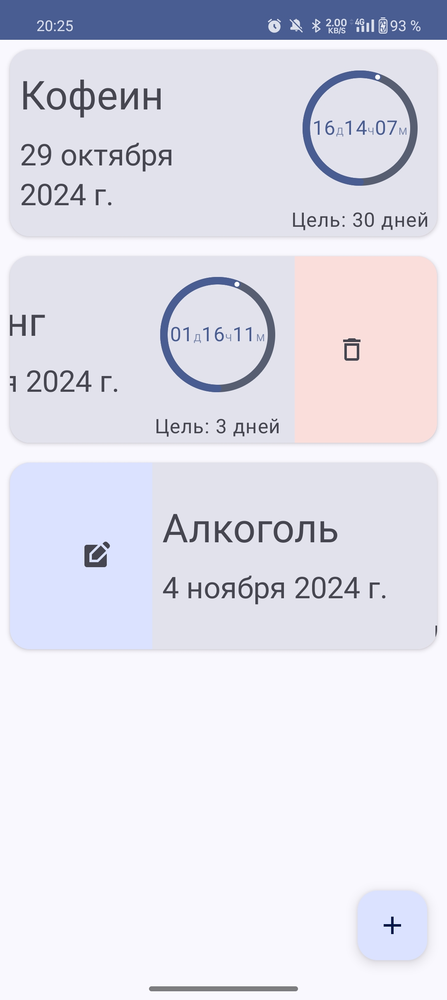
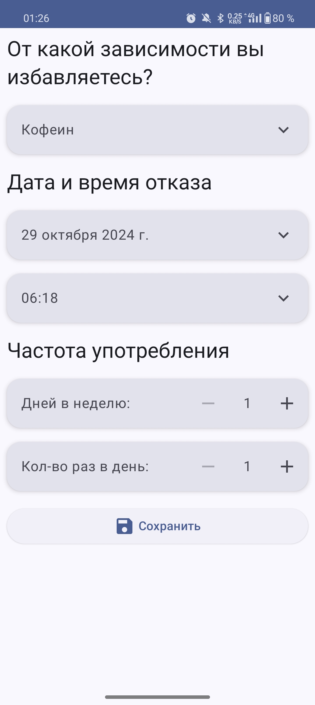
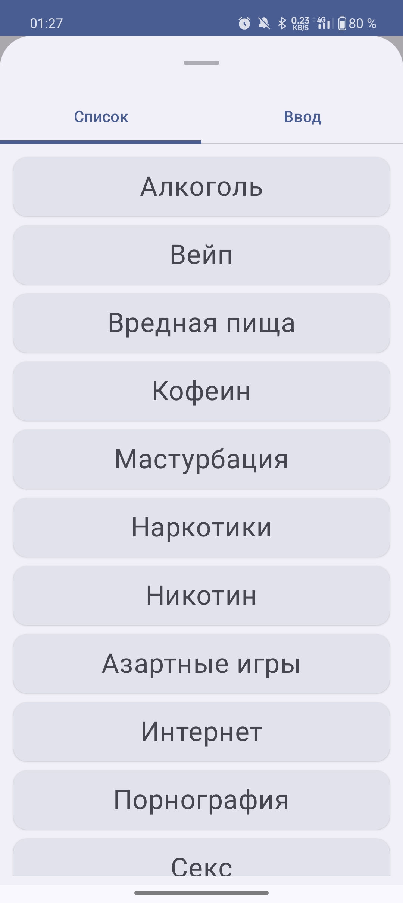
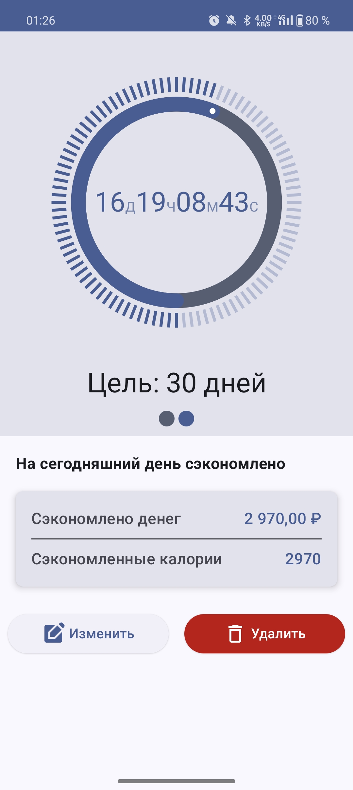
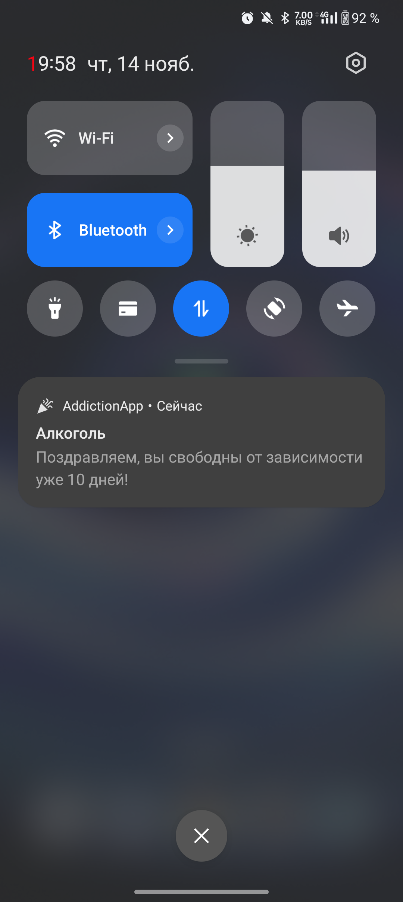

# AddictionApp

AddictionApp — это Android-приложение для отслеживания прогресса в борьбе с вредными привычками. Оно помогает пользователям устанавливать цели по отказу от различных привычек и отслеживать достижения с помощью удобного интерфейса и уведомлений. Приложение отображает, сколько денег и калорий было сэкономлено с момента отказа, что мотивирует пользователя на дальнейшее улучшение своего образа жизни.

## 📱 Скриншоты

### Главный экран 

 

### Создание цели отказа

   

### Подробная информация

### Уведомление

 

## 🚀 Основные возможности

- Создание цели по отказу от привычки: выбор типа зависимости (например, алкоголь), установка даты и времени отказа, настройка частоты.
- Мониторинг прогресса: таймер показывает, сколько времени прошло с момента отказа, и визуализирует достигнутый прогресс.
- Отслеживание экономии: приложение учитывает, сколько денег и калорий сэкономлено.
- Уведомления: напоминания для мотивации и достижения целей.
- Поддержка тем: поддерживаются светлая и тёмная темы приложения.
- Поддержка языков: доступен интерфейс на русском и английском языках.

## ⚙️ Технологический стек

- Jetpack Compose — декларативный UI-фреймворк.
- Dagger Hilt — внедрение зависимостей.
- Room — локальная база данных.
- WorkManager — выполнение фоновых задач и управление уведомлениями.
- Navigation Component — навигация между экранами.
- Coroutines — асинхронные операции.

## 🗂 Структура проекта

- app — основной модуль приложения.
- database — модуль с реализацией базы данных на Room.
- features:addictions-home — экран с отображением списка целей.
- features:addictions-add-edit — экран добавления и редактирования целей.
- features:addictions-details — экран детализации прогресса и экономии.
- addictions-data — модуль с источниками данных.
- addictions-uikit — набор UI-компонентов.
- core и core-utils — вспомогательные модули.
- navigation — модуль для навигации.
- activity — модуль для работы с Android Activity.

## 🧩 Пример использования

- На главном экране нажмите на кнопку «+», чтобы добавить новую цель отказа.
- Укажите тип зависимости, частоту и дату начала.
- Сохраните цель, и приложение начнёт отслеживать ваш прогресс.
- Получайте уведомления и просматривайте статистику экономии средств и калорий.
